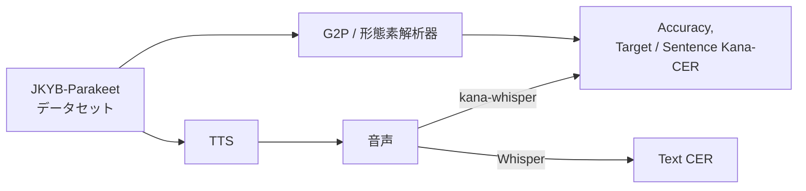
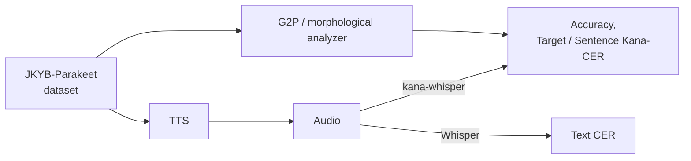

# 常用漢字読みベンチマーク Parakeet Edition


[](https://huggingface.co/datasets/Parakeet-Inc/joyo-kanji-yomi-benchmark-parakeet)
[日本語](#japanese) | [English](#english)

<a id="japanese"></a>

**常用漢字読みベンチマーク Parakeet Edition**は、日本語の形態素解析器や音声合成システムなどが、**日本語の文章中の漢字を正しく読めるか**を評価するためのベンチマークです。（略して**JKYB-Parakeet**と称します。）


JKYB-Parakeetは、SB Intuitionsによる**Joyo Kanji Yomi Benchmark** ([データセット](https://huggingface.co/datasets/sbintuitions/joyo-kanji-yomi-benchmark)と[評価リポジトリ](https://github.com/sbintuitions/Joyo-Kanji-Yomi-Benchmark))をもとに、[Parakeet株式会社](https://parakeet-inc.com/)が内容の検証を行い、データの誤りの修正や追加等に加えて、評価指標の追加・改善を独自に行ったものです。

## 本ベンチマークでできること

JKYB-Parakeetでは、次の2つのタスクに対する評価をサポートしています。
1. **G2P (Grapheme-to-Phoneme)・形態素解析・読み推定**: 与えられたテキストを読みのカタカナ列へ変換する
2. **TTS (Text-to-Speech)**: 与えられたテキストからその発話音声を生成する

これらの2つに対して、次のようなフローで指標を計算します：


## データについて

JKYB-Parakeetで用いる[データはHugging Face 🤗 で公開](https://huggingface.co/datasets/Parakeet-Inc/joyo-kanji-yomi-benchmark-parakeet)されています。
このデータは、[文化庁の常用漢字表](https://www.bunka.go.jp/kokugo_nihongo/sisaku/joho/joho/kijun/naikaku/kanji/index.html)の本表および付表に記載された**漢字と読みの全4,512組**を対象とし、1つの読みにつき3つ、**合計13,536文**の例文を用意しています。それぞれの例文に対しては次のような詳細なアノテーションが付けられています。

```json
{
    "key": "憧_ショウ_1",
    "text": "彼の文学作品には、理想郷への強い憧憬が見られる。",
    "tagged_text": "彼の文学作品には、理想郷への強い<憧>憬が見られる。",
    "yomi": "カレノブンガクサクヒンニワ、リソウキョウエノツヨイショウケイガミラレル。",
    "tagged_yomi": "カレノブンガクサクヒンニワ、リソウキョウエノツヨイ<ショウ>ケイガミラレル。",
    "reading_category": "on_yomi",
    "readings": {
        "natural": ["ショウ", "ドウ"],
        "marginal": []
    },
    "source": "original_alt"
}
```

`tagged_text`と`tagged_yomi`では、評価対象となる部分が `<>` で囲われています。`reading_category`は、対象の読みが音読み（`on_yomi`）、訓読み（`kun_yomi`）、または常用漢字表の付表の語（`joyo_appendix_reading`）のどれであるかを示します。`readings`の`natural`には自然な読み、`marginal`には不自然だが間違いとは言えない読みが記録されています。上の例では、`ショウ`と`ドウ`のどちらも自然な読みであるので、後述の評価指標では正解として扱います。

データセットの内容と各フィールドの詳細は、[Hugging Face上のREADME](https://huggingface.co/datasets/Parakeet-Inc/joyo-kanji-yomi-benchmark-parakeet)を参照してください。

## 評価指標

このベンチマークでは、G2PやTTSモデルの出力に対して、以下の評価指標を計算して出力します。この中で太字の指標が主な指標です。

| 指標 | 内容 |
|---|---|
| **Accuracy** | 評価対象の漢字の読みが、自然な読みと完全に一致した割合 |
| Relaxed Accuracy | 評価対象の漢字の読みが、自然な読みまたは許容可能な読みと完全に一致した割合 |
| **Target Kana-CER** | 評価対象の漢字の読みを、自然な読みと比較したカナCER |
| Relaxed Target Kana-CER | 評価対象の漢字の読みを、自然な読みまたは許容可能な読みと比較したカナCER |
| Sentence Kana-CER | 文全体の読みに対するカナCER |
| Text CER | TTSの場合、通常の漢字仮名交じりと元の文章との通常のCER |

Accuracy、Relaxed Accuracy、Target Kana-CER、Relaxed Target Kana-CERは、コーパス全体に加えて、音読み、訓読み、付表の語の分類ごとにも集計されます。

詳しい指標の計算方法やJoyo Kanji Yomi Benchmarkの評価ツールとの違いについては、[評価方法](docs/METRICS.md)を参照してください。


## 使用方法

Python環境には[uv](https://docs.astral.sh/uv/)を使うことを推奨します。

```bash
git clone https://github.com/Parakeet-Inc/Joyo-Kanji-Yomi-Benchmark-Parakeet-Edition
cd Joyo-Kanji-Yomi-Benchmark-Parakeet-Edition
uv sync
```

音声認識に必要な依存パッケージは、次のコマンドでインストールできます。

```bash
uv sync --extra asr
```

### G2Pの評価

評価したいG2P等を使って、データセットのテキストに対してカタカナの読み仮名を付与した、次のような形式のJSONLファイルを用意してください。各行の`key`にはデータセットと同じキーを、`yomi`にはモデルが出力した文全体の読みを記述します。

```json
{"key":"誤_ゴ_0","yomi":"カレノイトヲゴカイシテシマッタ。"}
{"key":"誤_ゴ_1","yomi":"セツメイヲゴカイシテイタ。"}
```

ファイルを準備したら、次のコマンドで評価が行われ、評価結果が `results/` へ保存されます。

```bash
uv run jkyb-eval g2p predictions.jsonl --output-dir results/
```

予測結果がない例文がある場合、デフォルトではエラーとなります。予測できなかった例文を誤りとして評価に含める場合は、`--allow-missing`を指定して実行してください。

> [!WARNING]
> 「君は誰？」「そこへ行く」等の助詞の「は」「へ」は、実際の発音である「ワ」「エ」が正解となります。このベンチマークのメインである漢字の正確性の評価指標には影響はほぼないはずですが、G2Pや読み推定タスクを行う際は可能ならばこの方針に合わせるようにしてください。

### TTSの評価

TTSを評価する際には、データセットの`text`に記録された各例文から音声を生成し、対応する`key`をファイル名として、次のように保存してください。

```text
synthesized_audio/
├── 誤_ゴ_0.wav
├── 誤_ゴ_1.wav
└── ...
```

音声を準備したら、次のコマンドを実行することで、評価結果が `results/` へ保存されます。

```bash
uv run --extra asr jkyb-eval tts synthesized_audio/ \
  --device cuda \
  --output-dir results/
```

音声が存在しない例文がある場合は、デフォルトではエラーとなります。生成できなかった音声を誤りとして評価に含める場合は`--allow-missing`を指定して実行してください。

TTSの評価では、Kana-CERの計算に[`sbintuitions/kana-whisper`](https://huggingface.co/sbintuitions/kana-whisper)を、Text CERの計算に[`openai/whisper-large-v3-turbo`](https://huggingface.co/openai/whisper-large-v3-turbo)を使用します。

## 出力

評価結果は`--output-dir`で指定したディレクトリに保存されます。

```text
results/
├── summary.md                    # 集計結果
├── summary.json                  # 集計結果（JSON）
├── details/
│   ├── all.jsonl                 # 全ての行の評価結果
│   ├── missing-inputs.jsonl      # 予測結果または音声がなかった行
│   ├── target-review.jsonl       # 評価対象の読みの要確認行
│   ├── sentence-mismatches.jsonl # 文全体の読みに差がある行
│   └── text-mismatches.jsonl     # 元の文章と書き起こしに差がある行（TTSのみ）
└── transcriptions/               # TTSの文字起こし
    ├── kana.jsonl
    ├── kana.meta.json
    ├── text.jsonl
    └── text.meta.json
```

## 元の評価ツールとの互換性

元のJoyo Kanji Yomi Benchmarkとはデータと評価方法が異なるため、両者のスコアを直接比較することはできません。詳しくは[評価方法](docs/METRICS.md)を参照してください。

## 引用

JKYB-Parakeetを使用する場合は、元のベンチマークの論文を引用し、使用データを`Joyo Kanji Yomi Benchmark: Parakeet Edition`と明記してください。

```bibtex
@misc{liu2026sarashina22ttstacklingkanjipolyphony,
  title={Sarashina2.2-TTS: Tackling Kanji Polyphony in Japanese Speech Generation via Data Scaling and Targeted Data Synthesis},
  author={Lianbo Liu and Shiao Zhu and Kai Washizaki and Reo Yoneyama and Haesung Jeon and Mengjie Zhao and Yusuke Fujita and Hao Shi and Nao Yoshida and Yuan Gao and Roman Koshkin and Yukiya Hono and Yui Sudo},
  year={2026},
  eprint={2606.25369},
  archivePrefix={arXiv},
  primaryClass={cs.SD},
  url={https://arxiv.org/abs/2606.25369}
}
```

## ライセンス

[MITライセンス](LICENSE)です。元のベンチマークと評価方法への帰属については[NOTICE](NOTICE)を参照してください。

---

<a id="english"></a>

# Joyo Kanji Yomi Benchmark: Parakeet Edition

The **Joyo Kanji Yomi Benchmark: Parakeet Edition** evaluates whether Japanese morphological analyzers, speech synthesis systems, and related systems read kanji correctly in Japanese sentences. We refer to it as **JKYB-Parakeet**.

JKYB-Parakeet is based on the **Joyo Kanji Yomi Benchmark** by SB Intuitions ([dataset](https://huggingface.co/datasets/sbintuitions/joyo-kanji-yomi-benchmark) and [evaluation repository](https://github.com/sbintuitions/Joyo-Kanji-Yomi-Benchmark)). [Parakeet Inc.](https://parakeet-inc.com/) independently reviewed its contents, corrected and expanded the data, and added and improved evaluation metrics.

## What You Can Evaluate

JKYB-Parakeet supports the evaluation of two tasks:

1. **G2P (Grapheme-to-Phoneme), morphological analysis, or reading prediction**: converting given text into a katakana reading sequence
2. **TTS (Text-to-Speech)**: generating spoken audio from given text

Metrics are calculated through the following flow:



## Data

The [data used by JKYB-Parakeet is available on Hugging Face](https://huggingface.co/datasets/Parakeet-Inc/joyo-kanji-yomi-benchmark-parakeet).
It covers all **4,512 kanji-reading pairs** listed in the main and appendix tables of the [Joyo Kanji Table published by the Agency for Cultural Affairs](https://www.bunka.go.jp/kokugo_nihongo/sisaku/joho/joho/kijun/naikaku/kanji/index.html). The dataset provides three example sentences for each reading, for a total of **13,536 sentences**. Each sentence has detailed annotations in the following format:

```json
{
    "key": "憧_ショウ_1",
    "text": "彼の文学作品には、理想郷への強い憧憬が見られる。",
    "tagged_text": "彼の文学作品には、理想郷への強い<憧>憬が見られる。",
    "yomi": "カレノブンガクサクヒンニワ、リソウキョウエノツヨイショウケイガミラレル。",
    "tagged_yomi": "カレノブンガクサクヒンニワ、リソウキョウエノツヨイ<ショウ>ケイガミラレル。",
    "reading_category": "on_yomi",
    "readings": {
        "natural": ["ショウ", "ドウ"],
        "marginal": []
    },
    "source": "original_alt"
}
```

In `tagged_text` and `tagged_yomi`, the part to be evaluated is enclosed in `<>`. `reading_category` indicates whether the target reading is On’yomi (`on_yomi`), Kun’yomi (`kun_yomi`), or a word from the Jōyō Kanji Table appendix (`joyo_appendix_reading`). The `natural` list under `readings` contains natural readings, while `marginal` contains readings that sound unnatural but cannot be considered incorrect. In the example above, both `ショウ` and `ドウ` are natural readings and are therefore treated as correct by the metrics described below.

See the [dataset README on Hugging Face](https://huggingface.co/datasets/Parakeet-Inc/joyo-kanji-yomi-benchmark-parakeet) for details about the dataset and its fields.

## Metrics

The benchmark calculates the following metrics for G2P and TTS output. Metrics in bold are the primary metrics.

| Metric | Description |
|---|---|
| **Accuracy** | Percentage of evaluated kanji readings that exactly match a natural reading |
| Relaxed Accuracy | Percentage that exactly match either a natural or an acceptable reading |
| **Target Kana-CER** | Kana-CER against the natural readings of the evaluated kanji |
| Relaxed Target Kana-CER | Kana-CER against the natural or acceptable readings of the evaluated kanji |
| Sentence Kana-CER | Kana-CER for the full-sentence reading |
| Text CER | For TTS, standard CER between a conventional kanji-and-kana transcription and the source sentence |

Accuracy, Relaxed Accuracy, Target Kana-CER, and Relaxed Target Kana-CER are also reported separately for On’yomi, Kun’yomi, and Jōyō appendix readings.

See [Evaluation Method](docs/METRICS.md) for detailed metric calculations and differences from the original Joyo Kanji Yomi Benchmark evaluator.

## Usage

We recommend using [uv](https://docs.astral.sh/uv/) to manage the Python environment.

```bash
git clone https://github.com/Parakeet-Inc/Joyo-Kanji-Yomi-Benchmark-Parakeet-Edition
cd Joyo-Kanji-Yomi-Benchmark-Parakeet-Edition
uv sync
```

The dependencies required for speech recognition can be installed as follows.

```bash
uv sync --extra asr
```

### Evaluating G2P

Use the G2P or other system you want to evaluate to generate katakana readings for the text in the dataset, and prepare a JSONL file in the following format. Set `key` to the corresponding dataset key and `yomi` to the full-sentence reading produced by the model.

```json
{"key":"誤_ゴ_0","yomi":"カレノイトヲゴカイシテシマッタ。"}
{"key":"誤_ゴ_1","yomi":"セツメイヲゴカイシテイタ。"}
```

Once the file is ready, run the following command. Results are saved to `results/`.

```bash
uv run jkyb-eval g2p predictions.jsonl --output-dir results/
```

Missing predictions cause an error by default. To include examples that the system could not predict, pass `--allow-missing`. They remain in the evaluation and are scored as empty outputs.

> [!WARNING]
> The particles `は` and `へ` in phrases such as `君は誰？` and `そこへ行く` are expected to be written as their actual pronunciations, `ワ` and `エ`. This should have almost no effect on the benchmark's primary measures of kanji-reading accuracy, but G2P and reading-prediction output should follow this convention where possible.

### Evaluating TTS

To evaluate TTS, generate audio from each sentence in the dataset's `text` field and save the files as follows, using the corresponding `key` as each filename.

```text
synthesized_audio/
├── 誤_ゴ_0.wav
├── 誤_ゴ_1.wav
└── ...
```

After preparing all audio files, run the following command. Results are saved to `results/`.

```bash
uv run --extra asr jkyb-eval tts synthesized_audio/ \
  --device cuda \
  --output-dir results/
```

If audio could not be generated for some examples, pass `--allow-missing` to include those examples as empty outputs. Without this option, missing audio files cause an error.

TTS evaluation uses [`sbintuitions/kana-whisper`](https://huggingface.co/sbintuitions/kana-whisper) to calculate Kana-CER and [`openai/whisper-large-v3-turbo`](https://huggingface.co/openai/whisper-large-v3-turbo) to calculate Text CER.

## Outputs

Results are saved in the directory specified by `--output-dir`.

```text
results/
├── summary.md                    # Aggregate results
├── summary.json                  # Aggregate results (JSON)
├── details/
│   ├── all.jsonl                 # Results for every row
│   ├── missing-inputs.jsonl      # Rows without predictions or audio
│   ├── target-review.jsonl       # Target-reading rows to review
│   ├── sentence-mismatches.jsonl # Rows with full-sentence reading differences
│   └── text-mismatches.jsonl     # Rows where source and transcription differ (TTS only)
└── transcriptions/               # TTS transcriptions
    ├── kana.jsonl
    ├── kana.meta.json
    ├── text.jsonl
    └── text.meta.json
```

## Compatibility with the Original Evaluator

The original Joyo Kanji Yomi Benchmark uses different data and evaluation methods, so its scores are not directly comparable. See [Evaluation Method](docs/METRICS.md) for details.

## Citation

When using JKYB-Parakeet, cite the original benchmark paper and identify the data as `Joyo Kanji Yomi Benchmark: Parakeet Edition`.

```bibtex
@misc{liu2026sarashina22ttstacklingkanjipolyphony,
  title={Sarashina2.2-TTS: Tackling Kanji Polyphony in Japanese Speech Generation via Data Scaling and Targeted Data Synthesis},
  author={Lianbo Liu and Shiao Zhu and Kai Washizaki and Reo Yoneyama and Haesung Jeon and Mengjie Zhao and Yusuke Fujita and Hao Shi and Nao Yoshida and Yuan Gao and Roman Koshkin and Yukiya Hono and Yui Sudo},
  year={2026},
  eprint={2606.25369},
  archivePrefix={arXiv},
  primaryClass={cs.SD},
  url={https://arxiv.org/abs/2606.25369}
}
```

## License

This project is released under the [MIT License](LICENSE). See [NOTICE](NOTICE) for attribution to the original benchmark and evaluation design.
